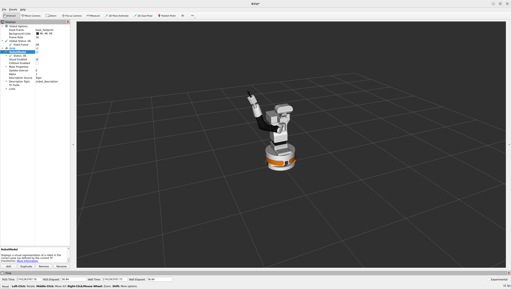
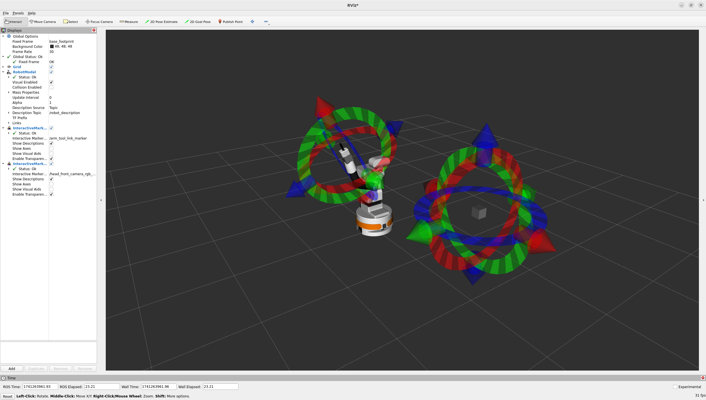
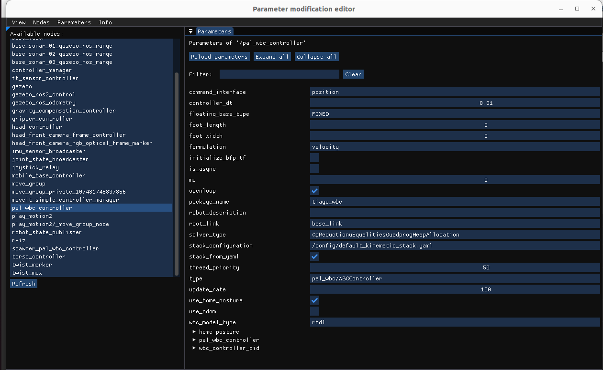

# Whole Body Control (WBC) Package for TIAGo

## Overview
The PAL Whole Body Control (WBC) is PAL’s implementation of the Stack of Tasks<sup>[1](http://homepages.laas.fr/ostasse/mansard_icar09.pdf)</sup>. It includes a hierarchical
quadratic solver that runs at 100 Hz, that is able to accomplish different tasks with different priorities assigned to each of them. To accomplish the tasks, the WBC can take control of all the joints of the robot.
When WBC starts an already predefined stack with a set of task is started. The set of task includes (from highest to lowest priority):

- Joint limit avoidance: to ensure joint limits are never reached.
- Self-collision avoidance: to prevent the robot from colliding with itself while moving.
- Cartesian position control: to command the robot end effector in cartesian space (position).
- Cartesian orientation control: to command the robot end effector in carteisan space (orientation).
- Gaze control: to control the head to look at a specific point in cartesian space.
- Reference posture: to define the default postural configuration of the robot in joint space.

## Usage

### Prerequisites
Ensure you have a running TIAGo robot or an active simulation with ros2 control.

### Switching Controllers
Deactivate the existing controllers before activating WBC:

```sh
ros2 control switch_controllers --deactivate arm_controller torso_controller head_controller
```

### Launching the Controller

```sh
ros2 launch tiago_wbc tiago_wbc.launch.py
```

⚠️ **Warning:** If you are controlling the real robot, you will need to launch the controller inside the robot using ssh.

### Visualizing in RViz2
RViz2 is used to visualize and interact with the controller.

1. Open RViz2:
   ```sh
   ros2 run rviz2 rviz2
   ```
2. Click the `Add` button (bottom left).
3. Select `RobotModel` from the `By display type` page.
4. Set the `Fixed Frame` (under `Global Options`) to `base_link`.
5. Expand the `RobotModel` tab and set `Description Topic` to `/robot_description`.



⚠️ **Warning:** If you are controlling the real robot, you will need to open RViz2 from a terminal connected to the robot by using `pal_connect`. 

### Adding Controller Markers

1. Click the `Add` button again.
2. Go to the `By topic` page.
3. Find `/arm_tool_link_marker` and double-click `InteractiveMarkers`.
4. Repeat for `/head_front_camera_optical_frame_marker`.

Once added, moving these markers will control the TIAGo model in RViz, which should also reflect in the Gazebo simulation or the real robot.




## Available Services

### Activate a Task
By default, all tasks are activated. You can manually activate a specific task if it has been deactivated or started inactive.

```sh
ros2 service call /pal_wbc_controller/activate_task pal_wbc_msgs/srv/ActivateTask "name: ''
order:
  order: 0
blend: false
blending_duration:
  sec: 0
  nanosec: 0"
```

### Deactivate a Task
Use caution when deactivating tasks. Deactivating joint limits or self collision might damage the robot.

```sh
ros2 service call /pal_wbc_controller/deactivate_task pal_wbc_msgs/srv/DeactivateTask "name: ''
blend: false
blending_duration:
  sec: 0
  nanosec: 0"
```

### Get Stack Description
Retrieve a list of all tasks with descriptions.

```sh
ros2 service call /pal_wbc_controller/stack_description pal_wbc_msgs/srv/GetStackDescription "{}"
```

### Remove a Task
This removes a task completely—it cannot be reactivated using `activate_task`.

```sh
ros2 service call /pal_wbc_controller/pop_task pal_wbc_msgs/srv/PopTask "name: 'cartesian_position'
blend: false
blending_duration:
  sec: 0
  nanosec: 0"
```

## Task Configuration  
Edit, add, or remove tasks in the [`config/default_kinematic_stack.yaml`](config/default_kinematic_stack.yaml) file. This file defines the available tasks and its parameters for the TIAGo robot, allowing customization. 

Ensure that any modifications align with the overall task structure and maintain compatibility with the robot’s motion planning framework.

⚠️ **Warning:** Always test any changes in a simulation environment before applying them to the real robot. Incorrect configurations could lead to unintended collisions, potentially damaging the robot or its surroundings.  

### Reference Types  

- **`pal_references::InteractiveMarkerReference`**: The end effector is controlled by moving the interactive marker in *RViz2*.  

- **`pal_references::TopicPoseReference`**: The end effector is controlled via a topic that publishes a `geometry_msgs/msg/Pose`. The topic name follows the pattern `<link_name>_pose`. In this case, it would be `/arm_tool_link_pose`. This is visualizable in rvizz as `/visualization_markers` as a MarkerArray.


## Reconfiguring Parameters
To adjust parameters dynamically, use `rig_reconfigure`:

```sh
ros2 run rig_reconfigure rig_reconfigure
```

Find the `pal_wbc_controller` node in the list and modify parameters as needed.




The main parameters to change are `PiDs` and `joint_limits`, as they directly affect the system's behavior and constraints.
